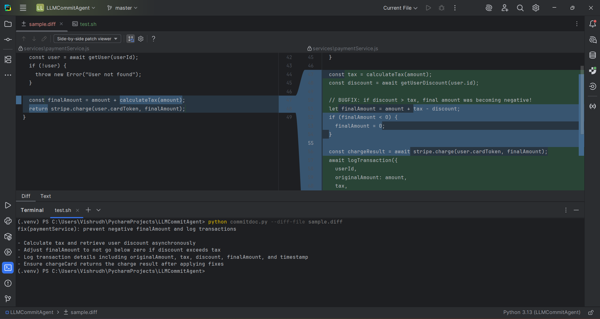

# 🚀 LLMCommitAgent — AI-Powered Conventional Commit Generator

LLMCommitAgent is a smart AI agent that automatically creates beautiful, accurate **Conventional Commit messages** using **OpenRouter LLMs** such as OpenAI, Claude, Grok, Gemini, DeepSeek, and more.

It works on:
- 💻 Windows (PowerShell / Git Bash / CMD)
- 🍎 macOS
- 🐧 Linux  
- 🔧 Any Git project  
- 🧪 Also works using `--diff-file` for testing

---

## ✨ Features

- 🧠 High-quality Conventional Commit messages  
- 🛠 Reads real Git diffs (`git diff --staged`)  
- 📄 Also supports: `--diff-file your.diff`  
- 🤖 Works with **ANY OpenRouter model**  
- ⚡ Fast, reliable HTTP-only API (no OpenAI SDK errors)  
- 🪟 Full Windows support (PowerShell installer included)  
- 🧹 Truncated diff support (safe for huge repos)  
- 🔗 Git hook integration (`prepare-commit-msg`)

---

## 📸 Live Execution Screenshot

Here is a real working screenshot of the agent generating a commit message from a complex diff:



---

# 📦 Installation

### 1️⃣ Clone the project
```bash
git clone https://github.com/yourname/LLMCommitAgent
cd LLMCommitAgent
````

### 2️⃣ Create & activate virtual environment

**Windows PowerShell**

```powershell
python -m venv .venv
.venv\Scripts\Activate.ps1
```

**macOS/Linux**

```bash
python3 -m venv .venv
source .venv/bin/activate
```

### 3️⃣ Install dependencies

```bash
pip install -r requirements.txt
```

---

# 🔐 Set OpenRouter API Key

Get your key 👉 [https://openrouter.ai/settings/keys](https://openrouter.ai/settings/keys)

**Windows (PowerShell, session only)**

```powershell
$env:OPENROUTER_API_KEY = "sk-..."
```

**Windows (permanent, restart terminal afterward)**

```powershell
setx OPENROUTER_API_KEY "sk-..."
```

**macOS/Linux**

```bash
export OPENROUTER_API_KEY="sk-..."
```

---

# 🤖 Usage

## ✔ A) Use a diff file (best for testing)

```powershell
python commitdoc.py --diff-file sample.diff --model "openai/gpt-5.1-instant"
```

## ✔ B) Auto-detect staged Git changes

```powershell
git add .
python commitdoc.py --model "anthropic/claude-4.5-sonnet-20250929"
```

## ✔ C) Write message to a file

```powershell
python commitdoc.py --diff-file my.diff --write-file commit_msg.txt
```

---

## 🥇 Top Picks (best balance of reasoning, code & “thinking” variants)
- **`openai/gpt-5.1-thinking`** 
- **`openai/gpt-5.1-instant`** 
- **`anthropic/claude-4.5-sonnet-20250929`** 
- **`x-ai/grok-5-code`** (or `x-ai/grok-code-fast-1`) 
- **`mistral/magistral`** 
- **`google/gemini-2.5-flash`** 
- **`deepseek/deepseek-v3.2-exp`** 
- **`openrouter/auto-router`** 
---

## ⚡ Quick usage examples (CLI)
```bash
# pick a thinking model for deep reasoning
python commitdoc.py --diff-file sample.diff --provider openrouter --model "openai/gpt-5.1-thinking"

# pick a fast code-oriented model
python commitdoc.py --diff-file sample.diff --provider openrouter --model "openai/gpt-5.1-instant"

# use auto-router fallback
python commitdoc.py --diff-file sample.diff --provider openrouter --model "openrouter/auto-router"
```

# 🔗 Git Hook Support (Auto Commit Messages)

## Install (PowerShell installer)

```powershell
powershell -ExecutionPolicy Bypass -File install_hook.ps1
```

## Then use Git normally:

```powershell
git add .
git commit
```

Your editor will open with an AI-generated commit message inserted automatically. ✨


---

# 🛠 Troubleshooting

### ❌ `OPENROUTER_API_KEY is not set`

Fix:

```powershell
$env:OPENROUTER_API_KEY="sk-..."
```

### ❌ 403 Error: "Key limit exceeded"

Meaning:

* Free-tier key quota is used up
* Even free models consume your key quota

Fix:

* 🔄 Create a new API key
* ⏳ Wait for quota reset
* 💳 Add small credit (even $1 increases quotas heavily)

### ❌ 429 or “rate-limited”

Fix:

* Switch model → Grok Code Fast or Claude
* Try OpenRouter Auto Router
* Avoid `:free` models

### ❌ Empty diff

Fix:

```bash
git add .
```

Or use:

```bash
python commitdoc.py --diff-file sample.diff
```

### ❌ Running `.sh` on Windows fails

Use PowerShell version:

```powershell
powershell -ExecutionPolicy Bypass -File install_hook.ps1
```

---

# 📄 License

MIT License.

---

# 💛 Thanks for using LLMCommitAgent!


